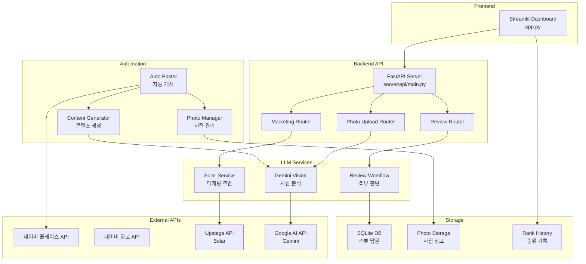
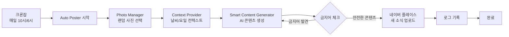
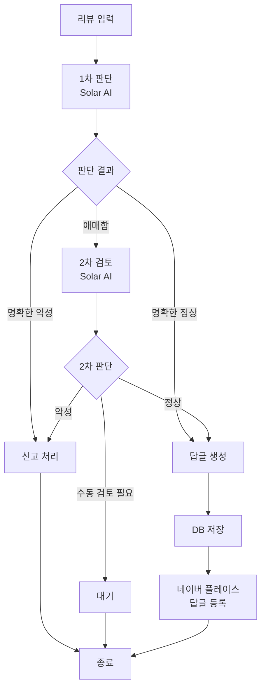

# 마장동딸 AI

네이버 플레이스 자동화 및 마케팅 솔루션

## 🎯 주요 기능

- 📈 **네이버 플레이스 순위 추적**: 실시간 순위 모니터링 및 분석
- 🤖 **AI 마케팅 글쓰기**: 사진 분석 기반 자동 마케팅 콘텐츠 생성
- 📸 **자동 새 소식 발행**: 매일 자동으로 네이버 플레이스에 새 소식 업로드
- 💬 **리뷰 답글 자동화**: AI 기반 리뷰 분석 및 답글 자동 생성

## 🚀 빠른 시작

### 1. 환경 설정

```bash
# 가상환경 생성 및 활성화
python -m venv venv
source venv/bin/activate  # Windows: venv\Scripts\activate

# 의존성 설치
pip install -r requirements.txt
```

### 2. 환경 변수 설정

`.env` 파일을 생성하고 다음 API 키를 설정하세요:

```env
# LLM API
UPSTAGE_API_KEY=your_solar_api_key
GOOGLE_AI_API_KEY=your_gemini_api_key

# 네이버 API (선택사항)
NAVER_PLACE_API_KEY=your_naver_place_api_key
NAVER_PLACE_ACCESS_TOKEN=your_naver_place_access_token
NAVER_AD_API_KEY=your_naver_ad_api_key
NAVER_AD_SECRET_KEY=your_naver_ad_secret_key
NAVER_AD_CUSTOMER_ID=your_naver_ad_customer_id
```

### 3. 실행

```bash
# Streamlit 대시보드
streamlit run app.py

# FastAPI 서버
uvicorn server.api.main:app --reload
```

## 📁 프로젝트 구조

```
majangdong-daughter-ai/
├── app.py                      # Streamlit 대시보드
├── server/
│   ├── api/                    # FastAPI 라우터
│   ├── automation/             # 자동화 시스템
│   ├── llm_service/            # LLM 서비스
│   ├── database/               # 데이터베이스 모델
│   └── scrapers/               # 웹 스크래핑
└── requirements.txt            # Python 패키지 의존성
```

## 🏗️ 시스템 아키텍처



## 🔄 자동화 워크플로우



## 💬 리뷰 답글 워크플로우



## 📚 문서

- [배포 가이드](DEPLOYMENT_GUIDE.md) - AWS 서버 배포 방법
- [자동화 설정 가이드](AUTOMATION_SETUP_GUIDE.md) - 자동 게시 시스템 설정
- [키워드 전략](KEYWORD_STRATEGY.md) - 네이버 플레이스 키워드 최적화

## 🔧 기술 스택

- **Frontend**: Streamlit
- **Backend**: FastAPI
- **AI Models**: 
  - Solar Pro (LLM - 텍스트 생성)
  - Gemini Flash (Vision - 이미지 분석)
- **Database**: SQLite
- **Automation**: Python + Cron

## 📝 라이센스

Private Repository

