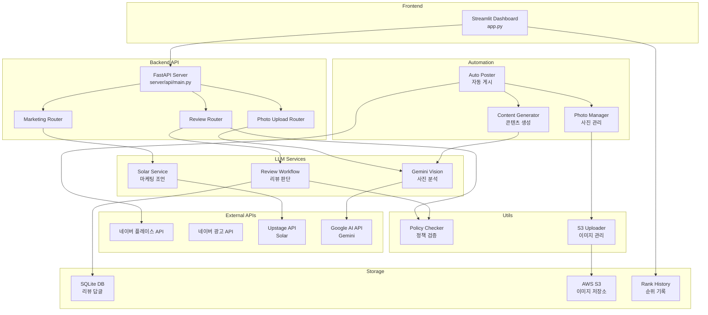
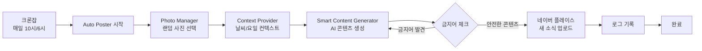
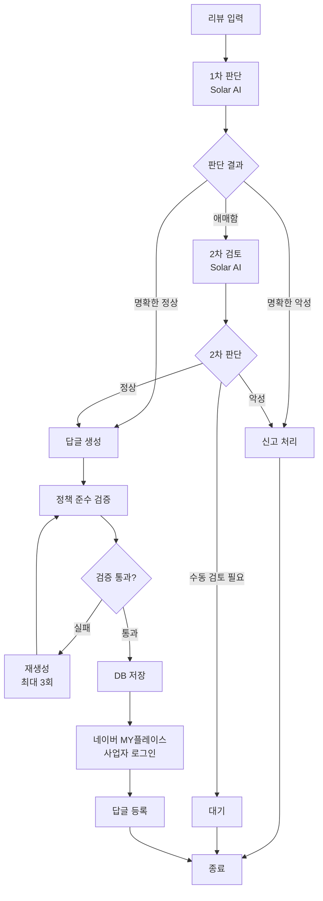

# 마장동딸 AI - 개발자 문서

> **개발자용 기술 문서**: 본 문서는 프로젝트 개발 및 운영을 위한 기술 가이드입니다.
> 프로젝트 개요 및 비즈니스 정보는 [PORTFOLIO_README.md](PORTFOLIO_README.md)를 참조하세요.

네이버 플레이스 자동화 및 마케팅 솔루션

## 🎯 주요 기능

- 📈 **네이버 플레이스 순위 추적**: 실시간 순위 모니터링 및 분석
- 🤖 **AI 마케팅 글쓰기**: 사진 분석 기반 자동 마케팅 콘텐츠 생성
- 📸 **자동 새 소식 발행**: 매일 자동으로 네이버 플레이스에 새 소식 업로드
- 💬 **리뷰 답글 자동화**: AI 기반 리뷰 분석 및 답글 자동 생성
- ✅ **정책 준수 검증**: 네이버 플레이스 정책 자동 검증 및 재생성
- 🔐 **사업자 로그인**: 네이버 MY플레이스 사업자 계정 자동 로그인
- ☁️ **S3 이미지 관리**: AWS S3 기반 이미지 저장 및 관리

## 🚀 빠른 시작

### 1. 환경 설정

```bash
# 가상환경 생성 및 활성화
python -m venv venv
source venv/bin/activate  # Windows: venv\Scripts\activate

# 의존성 설치
pip install -r requirements.txt
```

### 2. 환경 변수 설정

`.env` 파일을 생성하고 다음 API 키를 설정하세요:

```env
# LLM API
UPSTAGE_API_KEY=your_solar_api_key
GOOGLE_AI_API_KEY=your_gemini_api_key  # 유료 API 키 사용 권장

# Gemini Vision 모델 설정 (비용 효율 최적화)
# 💰 추천: models/gemini-2.0-flash (기본값, 비용 효율 최고)
#   - 무료 티어: 월 15회 무료
#   - 유료 사용: 입력 $0.075/1M 토큰, 출력 $0.30/1M 토큰
#   - 월 60회 예상 비용: 약 1-2원
#   - 정확도: 높음 (이미지 분석에 충분)
# 
# 다른 모델 옵션 (비추천 - 비용이 높음):
#   - models/gemini-1.5-pro (고품질, 비용 5-10배 높음)
#   - models/gemini-1.5-flash (빠른 응답, 비용 2-3배 높음)
#   - models/gemini-2.0-flash-exp (실험적, 불안정)
GEMINI_MODEL=models/gemini-2.0-flash

# 네이버 API (선택사항)
NAVER_ID=your_naver_id                    # 네이버 로그인 ID
NAVER_PASSWORD=your_naver_password        # 네이버 로그인 비밀번호
NAVER_AD_API_KEY=your_naver_ad_api_key
NAVER_AD_SECRET_KEY=your_naver_ad_secret_key
NAVER_AD_CUSTOMER_ID=your_naver_ad_customer_id

# AWS S3 (이미지 저장소)
AWS_ACCESS_KEY_ID=your_aws_access_key
AWS_SECRET_ACCESS_KEY=your_aws_secret_key
AWS_S3_BUCKET=your_bucket_name
AWS_REGION=ap-northeast-2
CLOUDFRONT_URL=https://your-cloudfront-url.cloudfront.net
```

### 3. 실행

```bash
# Streamlit 대시보드
streamlit run app.py

# FastAPI 서버
uvicorn server.api.main:app --reload
```

## 📁 프로젝트 구조

```
majangdong-daughter-ai/
├── app.py                      # Streamlit 대시보드
├── server/
│   ├── api/                    # FastAPI 라우터
│   │   ├── routers/            # API 엔드포인트
│   │   ├── naver_place.py     # 네이버 플레이스 API
│   │   └── naver_ads.py       # 네이버 광고 API
│   ├── automation/             # 자동화 시스템
│   ├── llm_service/            # LLM 서비스
│   ├── database/               # 데이터베이스 모델
│   ├── scrapers/               # 웹 스크래핑
│   └── utils/                  # 유틸리티
│       ├── policy_checker.py   # 정책 준수 검증
│       └── s3_uploader.py     # S3 이미지 업로더
├── scripts/                    # 유틸리티 스크립트
│   └── upload_to_s3.py        # S3 이미지 업로드 스크립트
└── requirements.txt            # Python 패키지 의존성
```

## 🏗️ 시스템 아키텍처



## 🔄 자동화 워크플로우



## 💬 리뷰 답글 워크플로우



## 📚 문서

### 프로젝트 개요
- [PORTFOLIO_README.md](PORTFOLIO_README.md) - 프로젝트 개요 및 비즈니스 정보

### 기술 문서
- [server/automation/README.md](server/automation/README.md) - 자동화 시스템 상세 가이드
- [docs/METRICS_ANALYSIS.md](docs/METRICS_ANALYSIS.md) - 수치 분석 및 성과 측정
- [docs/NAVER_PLACE_GUIDE.md](docs/NAVER_PLACE_GUIDE.md) - 네이버 플레이스 가이드 (비즈머니, 순위 전략 등)

### 설정 가이드
- [docs/AWS_S3_CLOUDFRONT_SETUP.md](docs/AWS_S3_CLOUDFRONT_SETUP.md) - AWS S3 및 CloudFront 설정
- [docs/AUTOMATION_SETUP_GUIDE.md](docs/AUTOMATION_SETUP_GUIDE.md) - 자동화 시스템 설정
- [docs/KEYWORD_STRATEGY.md](docs/KEYWORD_STRATEGY.md) - 네이버 플레이스 키워드 최적화 전략

## 🔧 기술 스택

- **Frontend**: Streamlit
- **Backend**: FastAPI
- **AI Models**: 
  - Solar Pro (LLM - 텍스트 생성)
  - Gemini Flash (Vision - 이미지 분석)
- **Database**: SQLite
- **Storage**: AWS S3 + CloudFront CDN
- **Automation**: Python + Cron
- **Browser Automation**: Playwright (네이버 플레이스 자동화)

## 📝 라이센스

Private Repository

